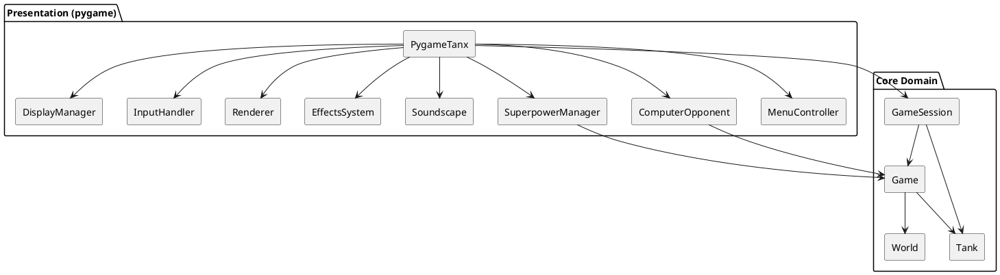
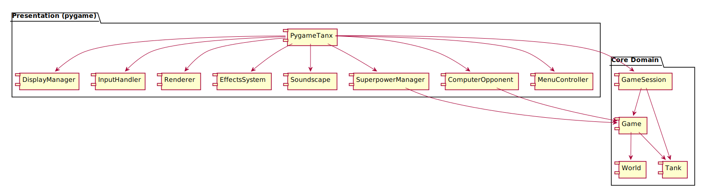
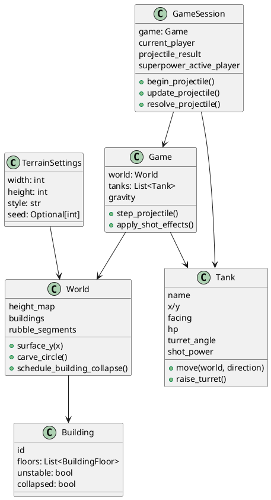

# Tanx Architecture Overview

Tanx is deliberately split into a deterministic **core domain layer** (`tanx_game.core`) and an opt-in **pygame presentation layer** (`tanx_game.pygame`). The command-line entry point (`main.py`) simply parses flags and calls `tanx_game.run_pygame`, which instantiates the `PygameTanx` façade and therefore wires every subsystem together.

## Layered structure

* **Core domain** – Procedural terrain (`World`, `TerrainSettings`, `Building`), the physical tanks (`Tank`), ballistics/damage simulation (`Game`, `ShotResult`), and turn sequencing (`GameSession`). This layer is renderer-agnostic and can be unit-tested without pygame.
* **Presentation layer** – `PygameTanx` coordinates input, rendering, effects, AI, audio, menus, superpowers, and persistence. It always reuses the `Game`/`GameSession` instances for authoritative gameplay state.
* **Assets/config** – Runtime assets under `tanx_game/pygame/assets` and persisted settings in `tanx_game/pygame/user_settings.json`.

### Component relationships

## Core domain

| Module | Responsibility highlights |
| --- | --- |
| `tanx_game/core/world.py` | Generates a height map with configurable style (`classic` vs `urban`), instantiates buildings, defers collapses, and exposes collision queries (`building_hit_test`, `rubble_hit_test`, `surface_y`). Terrain uses a high-resolution signed distance field and carving helpers (`carve_circle`) to model explosions. |
| `tanx_game/core/game.py` | Owns the tanks & world, simulates projectile flight (`step_projectile`), applies damage and splash (`apply_shot_effects`), resolves building collapses (`handle_building_collapse`), and settles tanks on the terrain. |
| `tanx_game/core/tank.py` | Encapsulates turret movement, power tweaks, health, and positioning constraints (preventing climbs steeper than a cell). |
| `tanx_game/core/session.py` | Tracks the active shooter, winner, projectile interpolation, superpower charge, and user-facing status message. It sequences turns independently of rendering latency. |

### Domain relationships

## Pygame presentation layer

`tanx_game/pygame/app.py` is the high-level façade. During construction it:

1. Boots pygame (video, fonts, mixer) and loads persisted preferences (`config.load_user_settings`).
2. Builds UI helpers (`DisplayManager`, `InputHandler`, `MenuController`, fonts, key bindings).
3. Instantiates the simulation (`Game`, `GameSession`, `EffectsSystem`, `SuperpowerManager`, `Soundscape`).
4. Configures AI parameters and lazy-loads audio banks.
5. Generates parallax background layers and procedural clouds based on the terrain seed.

At runtime:

* `run()` drives the 60 FPS loop by calling `_handle_events` → `_update` → `_draw`.
* `_update` advances particle systems, resolves building collapses, handles superpowers, ticks the AI and session, and pumps projectile animation frames.
* `_draw` composites the world via renderer helpers (`tanx_game/pygame/renderer/scene.py`) followed by UI overlays (`tanx_game/pygame/menus.py`) and menu overlays when applicable.

## Support subsystems

* **Input** – `InputHandler` interprets pygame events, handles cheat/menu toggles, and writes directly into the active tank (`Tank.raise_turret`, `Tank.increase_power`) before delegating to session helpers (`GameSession.attempt_move`, `_fire_projectile`). Continuous key presses use accumulated remainders for smooth turret/power motion.
* **Rendering** – Stateless drawing helpers in `renderer.scene` build the background, playfield, tanks, rubble, projectile trails, and weather using the offsets exposed by `PygameTanx`.
* **Effects & weather** – `EffectsSystem` tracks particle lifetimes, debris, camera shake triggers, and rain/snow drops. The main loop calls `effects.update` plus `effects.update_weather` every frame.
* **Menus** – The declarative `MenuController` + `MenuDefinition` pair drive state-specific option lists while `menus.draw_menu_overlay` renders the HUD and menu chrome.
* **Audio** – `Soundscape` lazily loads mixer assets, cycles through SDL audio drivers on failure, and maintains per-category volume. It exposes simple `play`, `play_loop`, and `set_volume` APIs that `PygameTanx` and `EffectsSystem` consume.
* **AI** – When the computer opponent is enabled, `ComputerOpponent` orchestrates a turn-based state machine (`thinking → aiming → firing`) and uses `ShotPlanner` to brute-force candidate angles/powers via `Game.step_projectile`.
* **Superpowers** – `SuperpowerManager` multiplexes cinematic effects (`BomberPower`, `SquadPower`) and out-of-band projectiles. Each power converts screen pixels to world coordinates before calling `_apply_superpower_damage`, which temporarily scales `Game` damage to reuse the normal destruction pipeline.

Together these layers keep the gameplay logic deterministic while letting the pygame layer evolve independently for visuals, audio, and UX. When adding new features, place deterministic rules inside `tanx_game.core` and treat `PygameTanx` as an adapter that translates player intent and renders the authoritative state.
