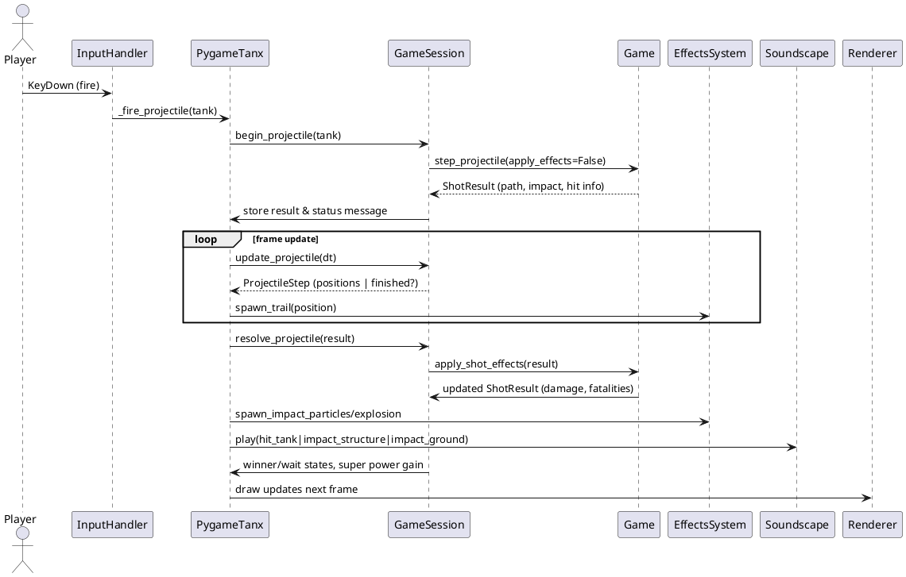
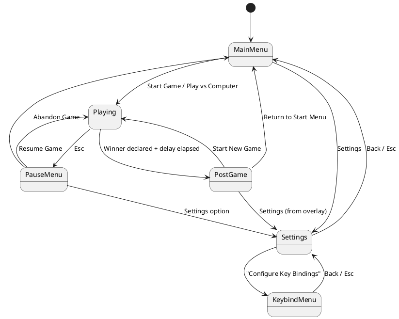

# Runtime Flow

This document captures the dynamic behaviour that ties the deterministic `tanx_game.core` layer to the pygame presentation front-end.

## Frame loop

`PygameTanx.run` (`tanx_game/pygame/app.py`) implements the classic `while self.running` loop. Each iteration:

1. Calls `clock.tick(60)` to clamp the frame delta (`dt`).
2. Pumps pygame events via `_handle_events`, which dispatches them into `InputHandler.process_event`.
3. Advances simulation and orchestration in `_update`:
   * updates particles, weather, camera shake, skyline sway, and superpowers,
   * ticks AI turns and continuous input,
   * runs the projectile animation driver (`GameSession.update_projectile`) and resolves impacts,
   * transitions to `post_game_menu` when a winner is declared and its delay expires.
4. Delegates to `_draw`, which renders the background, world, rubble, tanks, effects, weather, HUD, and any menu overlays before flipping the display surface.

The deterministic `Game` and `GameSession` instances are only mutated via the `_update` step.

## Projectile resolution sequence

Firing a shot touches multiple systems. The following sequence diagram shows the nominal flow for a human player's turn:

Notable details:

* The `GameSession` retains the projectile path to decouple simulation from animation timing.
* `_handle_projectile_resolution` picks the audio cue based on whether a tank, structure, or ground absorbed the impact.
* Fatal hits trigger extra debris via `EffectsSystem.spawn_fatal_debris` and extend the victory-delay timer before menus appear.

## Game state machine

`PygameTanx.state` switches among menu/gameplay modes, and `InputHandler` uses the state to decide how to interpret key presses. The core transitions are:

The cheat console (`F1`) lives outside the state machine and is guarded so it cannot open while projectiles are animating or a winner is already announced.

## Building collapse pipeline

Urban terrain enables destructible buildings that transition into rubble:

1. **Damage events** – `Game.step_projectile` detects `hit_building`/`hit_rubble`, and `apply_shot_effects` calls `_apply_building_damage` or `_apply_rubble_damage`. Destroying a ground floor marks the structure as unstable.
2. **Collapse scheduling** – When no intact floors remain or the first floor falls, `World.schedule_building_collapse` queues the structure with a configurable delay.
3. **World tick** – Each `_update` call invokes `World.update_collapsing_buildings(dt)`, which decreases timers and returns buildings ready to collapse. `_collapse_building` carves a crater, spawns rubble segments, and clears the original floors.
4. **Damage resolution** – For every collapsed building, `Game.handle_building_collapse` applies area damage/fatalities to nearby tanks. `GameSession.on_building_collapse` updates the message banner and winner state if necessary.
5. **Visual/audio feedback** – Dust columns and rubble chunks are spawned through `EffectsSystem`, the camera shake is bumped, and collapse SFX play through `Soundscape`.

## Superpower orchestration

Superpowers (`BomberPower`, `SquadPower`, `trajectory` preview) run outside the regular turn cycle. When a tank earns enough charge, pressing `B`, `N`, or `M` in `InputHandler` calls `_trigger_superpower`, which:

* Activates the corresponding `SuperpowerManager` effect.
* Suspends turn advancement until the effect finishes (projectiles, bombs, or squads call `apply_damage`, which internally reuses `Game.apply_shot_effects`).
* Restores the original damage profile afterward and resumes the turn order via `GameSession.complete_superpower`.

This design keeps superpowers deterministic without duplicating destruction logic.
