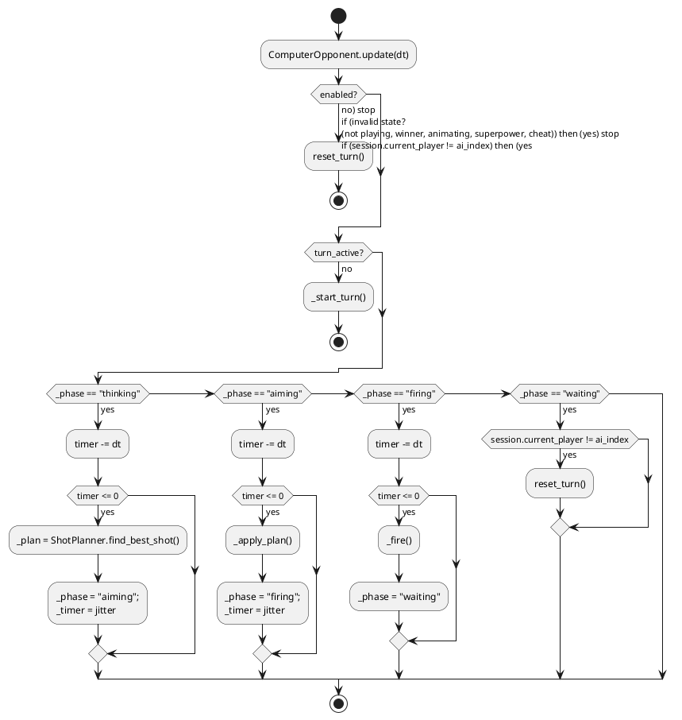
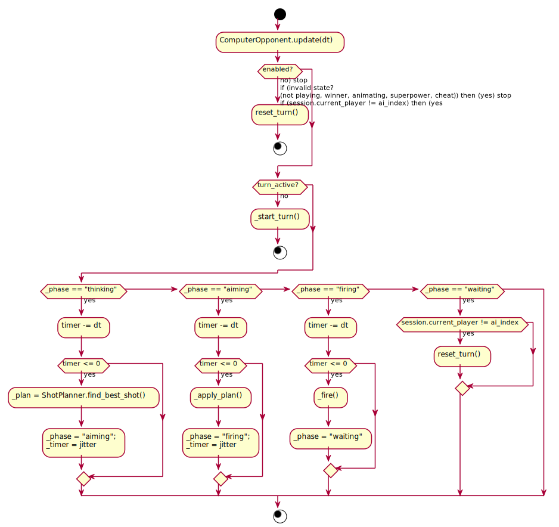

# System Details

This guide breaks Tanx into focused subsystems and explains how they collaborate. Use it when modifying existing behaviour or introducing new features.

## Terrain, structures, and destruction (`tanx_game/core/world.py`)

* **Generation styles** – `TerrainSettings.style` toggles between `classic` rolling hills (`_generate_classic_height_map`) and `urban` city blocks (`_generate_urban_height_map`). Both paths create a high-resolution height map (`detail` samples per cell) that feeds the signed-distance queries used everywhere else.
* **Buildings** – Urban generation stacks `BuildingFloor` instances into `Building` objects, levels the terrain beneath them, and caches rubble segments for future collapses. Floors track hit points individually so projectiles can shear off upper levels without instantly destroying the structure.
* **Collisions** – `building_hit_test`, `rubble_hit_test`, `surface_y`, and `is_column_blocked` provide all the collision queries invoked by `Game.step_projectile`, tank movement, and superpowers.
* **Deformation** – Explosions call `carve_circle` to excavate the ground and raise crater rims, after which `_smooth_heights` prevents numeric artifacts.
* **Collapse lifecycle** – When a `Building` becomes unstable, `schedule_building_collapse` enqueues it. The main loop periodically calls `update_collapsing_buildings` to trigger `_collapse_building`, spawn rubble, and carve the crater under the structure.

## Session and turn management (`tanx_game/core/session.py`)

`GameSession` sits between user intent and the core logic:

* Maintains the `current_player`, message banner, projectile interpolation state, and winner details.
* Acts as a finite automaton that sequences moves (`attempt_move`), projectile animation/resolution (`begin_projectile`, `update_projectile`, `resolve_projectile`), and superpower completion.
* Accumulates superpower charge per tank in `_update_super_power`, basing the gain on accuracy and proximity to opponents.

Because `GameSession` never depends on pygame, it can be exercised from tests or alternative front-ends.

## Input system (`tanx_game/pygame/input.py`)

* `InputHandler.process_event` handles discrete key presses, updates the cheat console, toggles menus, and routes gameplay keys to the active tank.
* `InputHandler.update` implements smooth aim/power adjustments by integrating held keys and storing fractional remainders, which keeps turret motion consistent regardless of frame rate.
* Menu navigation is entirely state-driven: when `PygameTanx.state` is `settings_menu` or `keybind_menu`, the handler remaps arrow keys to resolution/terrain/weather/damage volume adjustments or keybinding rebinding workflows.

## Rendering pipeline (`tanx_game/pygame/renderer/scene.py` + `menus.py`)

* The renderer helpers are stateless and always consume values pulled from `PygameTanx` (cell size, offsets, camera shake, terrain texture, etc.).
* Order matters: the background gradient and parallax skyline draw first, followed by the world mask, rubble, buildings, tanks, aim indicator, projectile trails, particles, smoke, debris, weather, UI overlay, and live menus.
* The HUD (`draw_ui`) lays out player stats, angle/power gauges, match scores, and instructions, while `draw_menu_overlay` renders the active menu title, description, and selectable options.

## Effects and weather (`tanx_game/pygame/effects.py`)

* Particle structs (`Particle`, `Debris`, `WeatherDrop`) model everything from dust to sparks to rain. Their updates consider gravity, ground normals (`world.ground_height` samples), and wind.
* `spawn_explosion`, `spawn_smoke_plume`, and `spawn_fatal_debris` centralize the visual response to hits, rising smoke, embers, and gore.
* Weather is data-driven: `set_weather` toggles `weather_type`, while `update_weather` spawns and animates rain or snow drops with configurable velocities and lifetimes.

## Audio engine (`tanx_game/pygame/soundscape.py`)

* The mixer wrapper attempts multiple SDL drivers (PulseAudio, PipeWire, ALSA, CoreAudio, DirectSound, WASAPI, WinMM, `dummy`) until one succeeds. Failures surface via `status_message`, which the UI displays.
* Sounds are tagged by category (`effects`, `ambient`, `ui`), and the effective volume is `master × category`.
* Ambient loops (rain/snow) use a dedicated channel so `Soundscape.set_volume` can adjust them in real time when the player tweaks settings.

## AI Commander (`tanx_game/pygame/ai.py`)

* `ShotPlanner` brute-forces candidate angle/power pairs by mutating the shooter temporarily, calling `Game.step_projectile`, and ranking the resulting `ShotResult` for proximity to any enemy tank.
* `ComputerOpponent` is a lightweight state machine that injects natural pauses (`thinking`, `aiming`, `firing`, `waiting`) and calls `_fire_projectile` once its plan is ready.
* The flow below highlights the major branches inside `ComputerOpponent.update`:

Tweaking the AI difficulty only replaces the planner parameters (`angle_step`, `power_step`, variance, precise search) and lets the rest of the flow stay untouched.

## Superpowers (`tanx_game/pygame/superpowers.py` + `PygameTanx._apply_superpower_damage`)

* Superpowers keep cinematic logic outside the deterministic core. `BomberPower` spawns a bomber that drops bombs along the opponent's x position, while `SquadPower` animates infantry sprites that march and fire volleys.
* Both powers work exclusively in screen space and convert coordinates back to world units before calling `apply_damage`, which funnels through `_apply_superpower_damage` so the regular crater/carve/splash logic is reused.
* The third "power" (`trajectory`) simply toggles a one-shot full ballistic preview. The renderer checks `SuperpowerManager.has_trajectory_preview` to decide whether to draw the longer dotted arc and impact marker.

## Persistence & configuration (`tanx_game/pygame/config.py`, `DisplayManager`, menus)

* User settings persist to `user_settings.json`. Reloading applies cell size, windowed fullscreen, key bindings, damage tweaks, AI difficulty, and volume levels before instantiating the simulation.
* `DisplayManager` provides resolution presets keyed off the current world dimensions, makes fullscreen vs. windowed decisions, and reports labels for the settings menu. Windowed-fullscreen mode dynamically scales terrain width to fill the desktop.
* Menu options are declaratively registered in `_register_menus`. Each option directly references an action method such as `_action_start_game`, `_action_open_settings`, `_action_cycle_weather_forward`, etc., so the flow is discoverable.

## CLI/text fallback (`tanx_game/core/game.py`)

Even without pygame, `Game.play` offers a text-mode artillery duel. It shares the same projectile simulation and world logic; the pygame client simply provides richer rendering, audio, and UX on top of this deterministic foundation.
